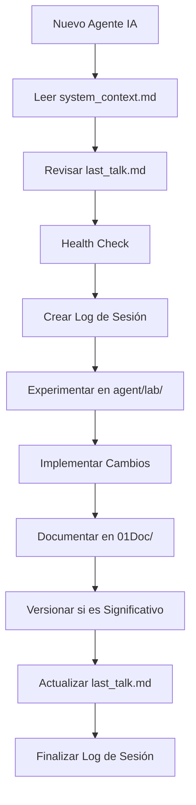
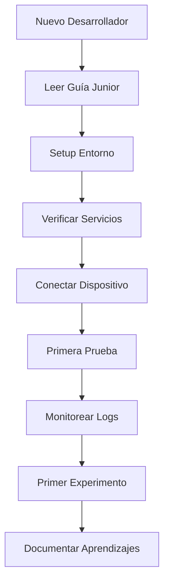

# 🎯 Guía Maestra del Ecosistema de Agentes IA

## 🧠 Introducción

Este documento explica cómo usar el **ecosistema completo de documentación y agentes IA** creado para el proyecto **Asistente de Voz Inteligente**. 

### 🎪 ¿Qué es este ecosistema?

Un sistema **estandarizado y escalable** que permite a cualquier agente IA (Claude, Cursor, Gemini, etc.) trabajar eficientemente en el proyecto con:
- **Contexto completo** del proyecto
- **Protocolos estrictos** de desarrollo
- **Trazabilidad total** de cambios
- **Documentación automática** y versionada

---

## 📋 Componentes del Ecosistema

### 🧠 **1. Contexto Maestro**
- **Archivo**: `system_context.md`
- **Propósito**: Fuente única de verdad del proyecto
- **Uso**: Primer archivo que debe leer CUALQUIER agente IA

### 🤖 **2. Mensaje de Sistema Estándar**
- **Archivo**: `01Doc/Mensaje_Sistema_Agentes_IA.md`
- **Propósito**: Protocolo obligatorio para todos los agentes IA
- **Uso**: Incluir en TODOS los prompts de agentes

### 👨‍💻 **3. Guía de Desarrollador Junior**
- **Archivo**: `01Doc/Guia_Desarrollador_Junior.md`
- **Propósito**: Onboarding completo para nuevos desarrolladores
- **Uso**: Primer recurso para cualquier nuevo miembro del equipo

### 📊 **4. Sistema de Logs de Agentes**
- **Directorio**: `01Doc/agents_logs/`
- **Propósito**: Trazabilidad completa de sesiones de agentes IA
- **Uso**: Cada agente debe crear su log de sesión

### 📋 **5. Control de Versiones**
- **Directorio**: `01Doc/versions/`
- **Propósito**: Historial de cambios y rollback capability
- **Uso**: Documentar cambios significativos

### 🧪 **6. Laboratorio de Experimentos**
- **Directorio**: `agent/lab/`
- **Propósito**: Espacio seguro para pruebas
- **Uso**: TODOS los experimentos deben hacerse aquí

---

## 🚀 Guía de Uso por Tipo de Usuario

### 🤖 **Para Agentes IA (Claude, Cursor, Gemini)**

#### 📋 **Al Iniciar Nueva Sesión**:
```bash
# 1. Leer contexto maestro
cat system_context.md

# 2. Revisar última conversación
cat last_talk.md

# 3. Verificar estado del sistema
./agent/scripts/health_check.sh

# 4. Crear log de sesión
echo "# Log de Sesión..." > 01Doc/agents_logs/session_$(date +%Y-%m-%d_%H%M).md
```

#### 🔬 **Durante Desarrollo**:
```bash
# Experimentar SIEMPRE en laboratorio
cd agent/lab
echo "mi_experimento" > test_$(date +%Y%m%d_%H%M).py

# Documentar cambios importantes
echo "## Cambio realizado..." >> 01Doc/versions/$(date +%Y-%m-%d)_cambio.md

# Monitorear logs
python scripts/mqtt-universal-monitor.py
```

#### 🌆 **Al Finalizar Sesión**:
```bash
# 1. Completar log de sesión
# 2. Actualizar last_talk.md con detalle extenso
# 3. Versionar cambios si son significativos
# 4. Limpiar archivos temporales en agent/lab/
```

### 👨‍💻 **Para Desarrolladores Nuevos**

#### 📖 **Lectura Obligatoria (en orden)**:
1. `system_context.md` - Contexto del proyecto
2. `01Doc/Guia_Desarrollador_Junior.md` - Guía paso a paso
3. `01Doc/Auth-API-Documentation.md` - API de autenticación
4. `01Doc/MQTT-Topics-Architecture.md` - Arquitectura de mensajes
5. `last_talk.md` - Estado actual del proyecto

#### 🔧 **Setup Inicial**:
```bash
# 1. Leer toda la documentación
find 01Doc/ -name "*.md" | head -5 | xargs cat

# 2. Configurar entorno
./start-dev.sh

# 3. Verificar servicios
./agent/scripts/health_check.sh

# 4. Conectar dispositivo móvil
cd audio_recorder_app
flutter devices
flutter run
```

### 🏢 **Para Project Managers**

#### 📊 **Monitoreo de Progreso**:
```bash
# Ver logs de agentes recientes
ls -la 01Doc/agents_logs/ | tail -10

# Revisar cambios del día
cat 01Doc/versions/$(date +%Y-%m-%d)_changelog.md

# Estado actual del proyecto
cat last_talk.md
```

---

## 🎯 Flujos de Trabajo Estándar

### 🔄 **Flujo de Desarrollo con IA**



### 📋 **Flujo de Onboarding de Desarrollador**



---

## 📚 Plantillas y Templates

### 📝 **Template de Log de Sesión**
```markdown
# 🤖 Log de Sesión de Agente IA

## 📅 Información de Sesión
- **Fecha**: YYYY-MM-DD
- **Hora inicio**: HH:MM
- **Agente**: [Claude/Cursor/Gemini]
- **Usuario**: [Nombre]

## 🎯 Objetivo Solicitado
[Descripción detallada]

## 🔧 Acciones Realizadas
1. [Acción 1]
2. [Acción 2]

## ✅ Resultados Obtenidos
- [Resultado 1]
- [Resultado 2]

## 📋 Tareas Pendientes
- [ ] [Tarea 1]
- [ ] [Tarea 2]

---
*🤖 Generado por [AGENTE] | YYYY-MM-DD*
```

### 📋 **Template de Versión**
```markdown
# 📋 Control de Versión - [COMPONENTE]

## 📊 Información de Versión
- **Componente**: [Nombre]
- **Versión**: v[X.Y.Z]
- **Fecha**: YYYY-MM-DD
- **Autor**: [Agente/Desarrollador]

## 🎯 Resumen del Cambio
[Descripción del cambio]

## 🔧 Cambios Detallados
### ✅ Agregado:
- [Cambio 1]

### 🔄 Modificado:
- [Cambio 1]

## ↩️ Procedimiento de Rollback
```bash
# Comandos para revertir
```

---
*📋 Autor: [AGENTE] | YYYY-MM-DD*
```

### 📅 **Template de Changelog**
```markdown
# 📅 Changelog - YYYY-MM-DD

## 🎯 Resumen del Día
[Descripción general]

## 🔧 Cambios Realizados
- [Cambio 1] - v[X.Y.Z]
- [Cambio 2] - v[X.Y.Z]

## 🤖 Agentes Activos
- [Agente] - [Tareas]

## 📊 Métricas
- Archivos modificados: [N]
- Versiones creadas: [N]

---
*📋 Generado automáticamente | YYYY-MM-DD*
```

---

## 🔧 Automatización y Scripts

### 🤖 **Scripts para Agentes IA**

#### 📝 **Crear Log de Sesión**
```bash
#!/bin/bash
# agent/scripts/create_session_log.sh

DATE=$(date +%Y-%m-%d_%H%M)
AGENT=${1:-"unknown"}
FILE="01Doc/agents_logs/session_${DATE}_${AGENT}.md"

cat > "$FILE" << EOF
# 🤖 Log de Sesión de Agente IA

## 📅 Información de Sesión
- **Fecha**: $(date +%Y-%m-%d)
- **Hora inicio**: $(date +%H:%M)
- **Agente**: $AGENT
- **Usuario**: [Pendiente]

## 🎯 Objetivo Solicitado
[Pendiente completar]

---
*🤖 Creado automáticamente | $(date +%Y-%m-%d)*
EOF

echo "✅ Log creado: $FILE"
```

#### 📋 **Crear Archivo de Versión**
```bash
#!/bin/bash
# agent/scripts/create_version.sh

COMPONENT=${1:-"unknown"}
VERSION=${2:-"1.0.0"}
DATE=$(date +%Y-%m-%d)
FILE="01Doc/versions/${DATE}_${COMPONENT}_v${VERSION}.md"

cat > "$FILE" << EOF
# 📋 Control de Versión - $COMPONENT

## 📊 Información de Versión
- **Componente**: $COMPONENT
- **Versión**: v$VERSION
- **Fecha**: $DATE
- **Autor**: [Pendiente]

## 🎯 Resumen del Cambio
[Pendiente completar]

---
*📋 Creado automáticamente | $DATE*
EOF

echo "✅ Versión creada: $FILE"
```

### 👨‍💻 **Scripts para Desarrolladores**

#### 📊 **Ver Estado del Proyecto**
```bash
#!/bin/bash
# scripts/project_status.sh

echo "📊 Estado del Proyecto - $(date)"
echo "================================"
echo ""
echo "🔧 Servicios:"
docker ps --format "table {{.Names}}\t{{.Status}}"
echo ""
echo "📋 Logs Recientes:"
ls -la 01Doc/agents_logs/ | tail -5
echo ""
echo "📅 Cambios Recientes:"
ls -la 01Doc/versions/ | tail -5
echo ""
echo "💬 Última Conversación:"
head -10 last_talk.md
```

---

## 🚨 Troubleshooting

### ❌ **Problemas Comunes**

#### 🔧 **"No encuentro la documentación"**
```bash
# Buscar en documentación
find 01Doc/ -name "*.md" | grep [TÉRMINO]
grep -r "término" 01Doc/
```

#### 🤖 **"El agente no tiene contexto"**
```bash
# Verificar que el agente tenga acceso a:
cat system_context.md
cat 01Doc/Mensaje_Sistema_Agentes_IA.md
```

#### 📊 **"Los logs no se crean"**
```bash
# Verificar permisos
ls -la 01Doc/agents_logs/
mkdir -p 01Doc/agents_logs/
chmod 755 01Doc/agents_logs/
```

---

## 🎯 Mejores Prácticas

### 🤖 **Para Agentes IA**
- ✅ SIEMPRE leer `system_context.md` primero
- ✅ Experimentar en `agent/lab/` antes de cambios
- ✅ Documentar TODOS los cambios significativos
- ✅ Actualizar `last_talk.md` al finalizar
- ❌ NUNCA hacer cambios en raíz sin justificación
- ❌ NUNCA omitir el health check

### 👨‍💻 **Para Desarrolladores**
- ✅ Leer documentación antes de preguntar
- ✅ Usar `agent/lab/` para experimentos
- ✅ Documentar descubrimientos importantes
- ✅ Seguir nomenclatura establecida
- ❌ NUNCA romper la estructura de directorios
- ❌ NUNCA commitear archivos de `agent/lab/`

---

## 🎪 Beneficios del Sistema

### 🚀 **Escalabilidad**
- Múltiples agentes pueden trabajar sin conflictos
- Onboarding de nuevos desarrolladores en minutos
- Trazabilidad completa de todos los cambios

### 📊 **Calidad**
- Documentación siempre actualizada
- Patrones estandarizados
- Rollback capability para cambios problemáticos

### 🔧 **Eficiencia**
- Contexto inmediato para cualquier agente
- Menos tiempo buscando información
- Automatización de tareas repetitivas

---

## 📋 Próximos Pasos

### 🔄 **Evolución del Sistema**
- [ ] Automatizar más procesos
- [ ] Crear métricas de efectividad
- [ ] Implementar alertas automáticas
- [ ] Crear interfaces web para logs

### 📊 **Análisis y Mejora**
- [ ] Implementar dashboards de métricas
- [ ] Crear reportes de tendencias
- [ ] Optimizar templates basado en uso
- [ ] Crear sistema de feedback

---

*🎯 Guía Maestra creada: 2025-07-05*  
*📋 Ecosistema completo listo para uso productivo*  
*🚀 ¡Bienvenido al futuro del desarrollo con IA!* 