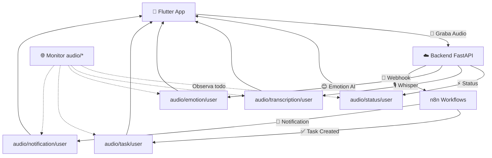

# 🌐 **MQTT Topics Architecture - Asistente Voz Realtime v1.0**

## 📡 **Arquitectura de Topics MQTT**

### **📋 Esquema General**
```
audio/
├── transcription/{user_id}    # 🎙️ Resultados de transcripción Whisper
├── status/{user_id}           # ⚡ Estados del procesamiento
├── notification/{user_id}     # 📢 Notificaciones push para Flutter
├── task/{user_id}             # ✅ Tareas creadas por IA
├── emotion/{user_id}          # 😊 Análisis emocional
├── flutter/{user_id}          # 📱 Mensajes desde/hacia Flutter app
├── system                     # 🔧 Mensajes del sistema
└── test/{test_name}           # 🧪 Topics de testing y desarrollo
```

### **🎯 Wildcard Universal**
- **Topic**: `audio/#`
- **Descripción**: Captura TODOS los mensajes del ecosistema de voz
- **Uso**: Monitor universal con `scripts/mqtt-universal-monitor.py`

---

## 📖 **Documentación por Topic**

### **🎙️ 1. TRANSCRIPCIÓN** - `audio/transcription/{user_id}`

**Propósito**: Enviar resultados de transcripción de Whisper al cliente Flutter

**Publisher**: Backend FastAPI (Whisper Service)  
**Subscriber**: Flutter App

**Estructura del mensaje**:
```json
{
  "audio_id": "20240126_143052_abc123",
  "text": "Transcripción completa del audio...",
  "confidence": 0.87,
  "language": "es",
  "duration": 60.5,
  "timestamp": "2024-01-26T14:30:52Z",
  "source": "whisper-backend",
  "user_id": "single-user"
}
```

**Ejemplo de uso**:
```bash
# Suscribirse
mosquitto_sub -h 192.168.3.3 -t "audio/transcription/single-user"

# Publicar (desde backend)
mosquitto_pub -h 192.168.3.3 -t "audio/transcription/single-user" \
  -m '{"text":"Hola mundo", "confidence":0.95, "language":"es"}'
```

---

### **⚡ 2. STATUS** - `audio/status/{user_id}`

**Propósito**: Comunicar estados de procesamiento en tiempo real

**Publisher**: Backend FastAPI  
**Subscriber**: Flutter App, Monitor Tools

**Estados posibles**:
- `received` - Audio recibido
- `transcribing` - Procesando con Whisper
- `analyzing` - Análisis emocional/entidades
- `webhook_sent` - Enviado a n8n
- `completed` - Proceso completado
- `error` - Error en el proceso

**Estructura del mensaje**:
```json
{
  "audio_id": "20240126_143052_abc123",
  "status": "transcribing",
  "progress": 45,
  "message": "Procesando audio con Whisper...",
  "timestamp": "2024-01-26T14:30:52Z",
  "estimated_completion": "2024-01-26T14:31:20Z"
}
```

---

### **📢 3. NOTIFICACIONES** - `audio/notification/{user_id}`

**Propósito**: Enviar notificaciones push a la app Flutter

**Publisher**: Backend, n8n Workflows, External Systems  
**Subscriber**: Flutter App

**Tipos de notificación**:
- `info` - Información general
- `success` - Operación exitosa
- `warning` - Advertencia
- `error` - Error crítico
- `task_created` - Nueva tarea generada

**Estructura del mensaje**:
```json
{
  "type": "task_created",
  "title": "Nueva tarea creada",
  "message": "Se ha creado la tarea: Llamar al cliente X",
  "priority": "high",
  "action_url": "/tasks/12345",
  "timestamp": "2024-01-26T14:30:52Z",
  "metadata": {
    "task_id": "task_12345",
    "source": "voice_command"
  }
}
```

**Ejemplo para enviar notificación**:
```bash
mosquitto_pub -h 192.168.3.3 -t "audio/notification/single-user" \
  -m '{
    "type": "info",
    "title": "Prueba",
    "message": "Esta es una notificación de prueba",
    "priority": "normal"
  }'
```

---

### **✅ 4. TAREAS** - `audio/task/{user_id}`

**Propósito**: Comunicar tareas creadas por IA basadas en comandos de voz

**Publisher**: n8n Workflows, Backend IA  
**Subscriber**: Flutter App, Task Management Systems

**Estructura del mensaje**:
```json
{
  "task": {
    "id": "task_12345",
    "title": "Llamar al cliente Juan Pérez",
    "description": "Seguimiento de propuesta comercial",
    "priority": "high",
    "due_date": "2024-01-27T09:00:00Z",
    "category": "ventas",
    "estimated_duration": 30,
    "created_from_audio": "20240126_143052_abc123"
  },
  "trigger": {
    "voice_command": "Recuérdame llamar a Juan Pérez mañana",
    "confidence": 0.92,
    "extracted_entities": {
      "person": "Juan Pérez",
      "action": "llamar",
      "when": "mañana"
    }
  },
  "timestamp": "2024-01-26T14:30:52Z"
}
```

---

### **😊 5. EMOCIONES** - `audio/emotion/{user_id}`

**Propósito**: Enviar análisis emocional del audio

**Publisher**: Backend IA (Emotion Analysis Service)  
**Subscriber**: Flutter App, Analytics Systems

**Estructura del mensaje**:
```json
{
  "audio_id": "20240126_143052_abc123",
  "emotions": {
    "alegria": 0.75,
    "confianza": 0.60,
    "estres": 0.25,
    "neutral": 0.10
  },
  "primary_emotion": "alegria",
  "energy_level": "alto",
  "speech_rate": "normal",
  "confidence": 0.83,
  "analysis_model": "emotion-ai-v2",
  "timestamp": "2024-01-26T14:30:52Z"
}
```

---

### **📱 6. FLUTTER APP** - `audio/flutter/{user_id}`

**Propósito**: Comunicación bidireccional con la app Flutter

**Publisher**: Flutter App  
**Subscriber**: Backend, Monitoring Tools

**Tipos de mensajes desde Flutter**:

#### **🎵 Inicio de grabación**:
```json
{
  "action": "recording_started",
  "audio_id": "20240126_143052_abc123",
  "duration_planned": 60,
  "quality": "high",
  "device_info": {
    "model": "M2101K6P",
    "os": "Android 12",
    "app_version": "1.0.0"
  },
  "timestamp": "2024-01-26T14:30:52Z"
}
```

#### **🛑 Fin de grabación**:
```json
{
  "action": "recording_completed",
  "audio_id": "20240126_143052_abc123",
  "duration_actual": 58.3,
  "file_size": 1024000,
  "upload_status": "uploading",
  "timestamp": "2024-01-26T14:31:50Z"
}
```

#### **🔄 Estado de conectividad**:
```json
{
  "action": "connectivity_status",
  "wifi_connected": true,
  "mqtt_connected": true,
  "backend_reachable": true,
  "signal_strength": -45,
  "timestamp": "2024-01-26T14:30:52Z"
}
```

#### **❌ Errores desde Flutter**:
```json
{
  "action": "error_report",
  "error_type": "upload_failed",
  "error_message": "Failed to upload audio file",
  "audio_id": "20240126_143052_abc123",
  "error_code": "ERR_NETWORK_TIMEOUT",
  "stack_trace": "...",
  "timestamp": "2024-01-26T14:30:52Z"
}
```

---

### **🔧 7. SISTEMA** - `audio/system`

**Propósito**: Mensajes globales del sistema

**Publisher**: Backend, Docker Services, Health Checks  
**Subscriber**: Monitoring Tools, DevOps Systems

**Tipos de mensajes**:

#### **💾 Estado de servicios**:
```json
{
  "type": "service_health",
  "services": {
    "whisper_service": "healthy",
    "mqtt_broker": "healthy",
    "mongodb": "healthy",
    "n8n": "healthy"
  },
  "total_uptime": 3600,
  "timestamp": "2024-01-26T14:30:52Z"
}
```

#### **📊 Estadísticas**:
```json
{
  "type": "system_stats",
  "stats": {
    "total_recordings_today": 45,
    "total_transcriptions": 43,
    "total_tasks_created": 12,
    "average_processing_time": 8.5,
    "storage_used": "1.2GB"
  },
  "timestamp": "2024-01-26T14:30:52Z"
}
```

---

### **🧪 8. TESTING** - `audio/test/{test_name}`

**Propósito**: Topics para desarrollo y testing

**Publisher**: Developer Tools, Test Scripts  
**Subscriber**: Development Tools

**Ejemplos**:
- `audio/test/transcription_quality` - Pruebas de calidad de transcripción
- `audio/test/emotion_analysis` - Pruebas de análisis emocional
- `audio/test/load_testing` - Pruebas de carga
- `audio/test/integration` - Pruebas de integración

---

## 🛠️ **Herramientas de Desarrollo**

### **📡 Monitor Universal**
```bash
# Ejecutar monitor que captura TODOS los topics audio/*
./scripts/mqtt-universal-monitor.py
```

### **📝 Publicar mensajes de prueba**
```bash
# Ver herramientas en agent/
./agent/mqtt-publisher.py
```

### **🔍 Explorar topics existentes**
```bash
# Ver todos los topics activos
mosquitto_sub -h 192.168.3.3 -t '$SYS/broker/clients/connected'
```

---

## 🔄 **Flujo Completo de Datos**



---

## 📋 **Registro de Topics Usados**

### **✅ Topics Implementados**
| Topic | Estado | Implementado en | Notas |
|-------|--------|----------------|--------|
| `audio/transcription/single-user` | ✅ Activo | Backend FastAPI | Whisper results |
| `audio/status/single-user` | ✅ Activo | Backend FastAPI | Processing status |
| `audio/notification/single-user` | 🔄 En desarrollo | - | Push notifications |
| `audio/task/single-user` | 🔄 En desarrollo | n8n workflows | Task creation |
| `audio/emotion/single-user` | 🔄 En desarrollo | - | Emotion analysis |
| `audio/flutter/single-user` | 📝 Planeado | Flutter App | App messages |
| `audio/system` | 📝 Planeado | Docker services | System health |

### **📝 Próximos Topics**
- `audio/flutter/connectivity` - Estado de conexión detallado
- `audio/task/completed` - Tareas completadas  
- `audio/analytics/daily` - Estadísticas diarias
- `audio/backup/status` - Estado de respaldos

---

## 🔐 **Seguridad y Mejores Prácticas**

### **🛡️ Autenticación**
- Actualmente: Sin autenticación (desarrollo)
- Producción: Implementar MQTT con usuario/contraseña
- SSL/TLS: Configurar certificados para producción

### **📊 Rate Limiting**
- Máximo 100 mensajes/minuto por usuario
- Máximo 1MB payload por mensaje
- Timeout de conexión: 60 segundos

### **🗃️ Retención de Mensajes**
- QoS 0: At most once delivery
- QoS 1: At least once delivery (para topics críticos)
- Retain: Solo para status y system messages

---

## 🚀 **Comandos Útiles**

### **🔍 Exploración**
```bash
# Ver todos los topics con wildcard
mosquitto_sub -h 192.168.3.3 -t "audio/#" -v

# Ver solo transcripciones
mosquitto_sub -h 192.168.3.3 -t "audio/transcription/+"

# Ver estadísticas del broker
mosquitto_sub -h 192.168.3.3 -t "\$SYS/broker/load/messages/received/1min"
```

### **📝 Testing**
```bash
# Enviar notificación de prueba
mosquitto_pub -h 192.168.3.3 -t "audio/notification/single-user" \
  -m '{"type":"info","title":"Test","message":"Mensaje de prueba"}'

# Simular transcripción
mosquitto_pub -h 192.168.3.3 -t "audio/transcription/single-user" \
  -m '{"text":"Hola mundo","confidence":0.95,"language":"es"}'
```

---

*📅 Última actualización: 2024-01-26*  
*🔄 Este documento se actualiza automáticamente cada vez que se implementa un nuevo topic* 